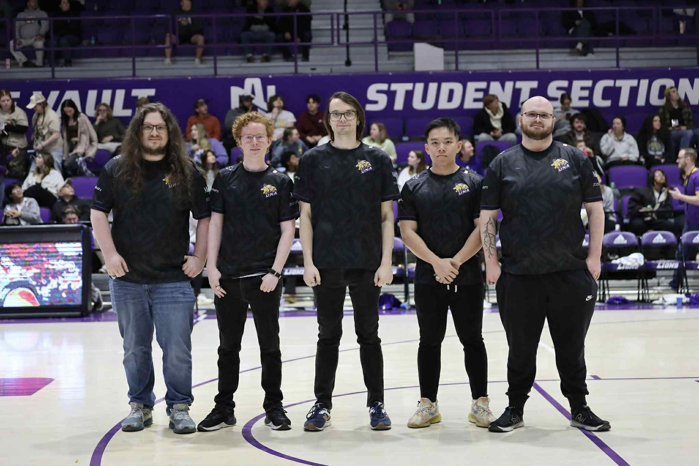

# Thuan Nguyen’s Project Alpha

## 📌 Overview
This project is a personal blog website created by **Thuan Nguyen**, a student from Saigon, Vietnam, currently studying at the University of North Alabama.  
The website introduces myself, my hobbies, and my journey in learning web development.  

The site is built with **HTML5**, **CSS3**, **Bootstrap 5**, and some **JavaScript**.  

---

## 🗺️ Page Map
- **index.html** → Homepage
- **/pages/blog.html** → About page  
- **/pages/project.html** → Education page  
- **/pages/resources.html** → Contact page  
- **/styles/style.css** → Custom styles  
- **/scripts/scripts.js** → JavaScript functions (e.g., button alert)  
- **/images/** → Backgrounds, wireframes, and other images  


 
---

## 🖼️ Wireframe
A wireframe was created to outline the structure of the homepage before development.  

  

*(Wireframe is saved in `/images/wireframe.png`)*  

---

## 🌍 How to View
- **Live Site:** [👉 Click here](https://your-live-link.com)  
- Or download the repository and open `index.html` directly in a browser.  

---

## 💻 Code Snippet Example
Here’s how I made a button trigger an alert:  

```html
	<div class="container-fluid pt-5">
		<div class="row">
			<div class="col-12" id="imageContainer">
				
				
			</div>
			<div class="click col-12">
				<p>Click the image to see the magic</p>
			</div>
		</div>
	</div>
```

```javascript
document.
    addEventListener("DOMContentLoaded",()=>{
    console.log("we workin'!");
    }
);

var currentImg = 1;
document.getElementById("imageContainer").onclick = function() {

    if (currentImg == 1)
    {
        document.getElementById("doge-1").style.display = 'none';
        document.getElementById("doge-2").style.display = 'block';
        currentImg = 2;
    }
    else
    {
        document.getElementById("doge-1").style.display = 'block';
        document.getElementById("doge-2").style.display = 'none';
        currentImg = 1;
    }
};
```
---

## ➡️ Explanation:

JavaScript adds a click event listener to the button.

When clicked, it changes images in `index.html`.

## 🤝 Credit & Disclosure

Created by: Thuan Nguyen

Collaboration: With my brother (No Use of AI)

Tools & Libraries Used:

Bootstrap 5
 – CSS framework

Normalize.css
 – CSS reset

javascript
 – simple scripting

Images: Wireframe and Page map made with hand-drawn
